# 基于机器学习模型分类房颤数据
# **数据集介绍**
竞赛数据集 RR seg_AFxls 和 RR seg_nonAF.xls。

数据集总共包含 40484 条心电 RR 间期序列，每条序列由
30 个 RR 间期值组成。其中数据集 RR_scg_AFls.xls 包含17247条房额信号的 RR 间期序列值，数据集 RR_seg_nonAF.xls包含23237 条非房颤信号的 RR 间期序列值,原数据集中**每条 RR 序列(每一行)都为30个RR间期值**。

所有数据作为本次竞赛的训练集提供给参赛者，测试集不公开，仅用于竞赛评测。
# **一：特征预处理**

**实验目的：** 读取房颤和非房颤的数据，对数据集进行特征提取，前后共提取了八个特征属性，均值,标准差,最小值,最大值,范围,中值,方差，熵。利用散点图观察了对应属性值的特点，并将提取后的特征属性和对应标签存入excel表格中。

**（在尝试对30维源数据进行PCA降维发现，不降维时的正确率最高，故没有对30维的源数据进行降维后，直接提取了8个特征属性。）**

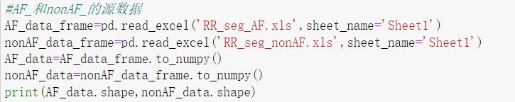

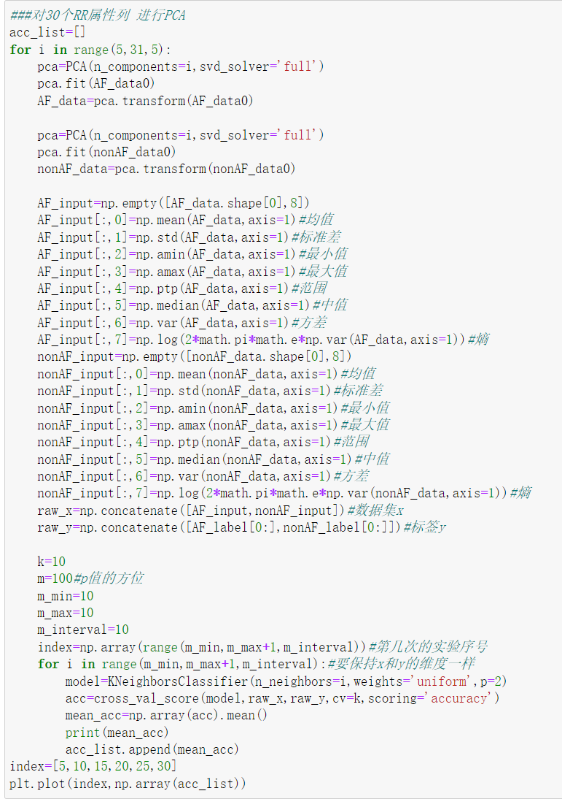

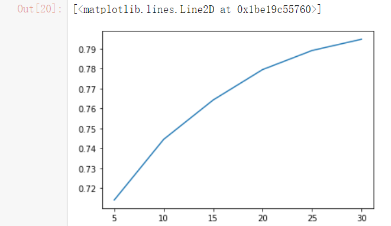

故不对30维的源数据集进行降维时，效果最好。

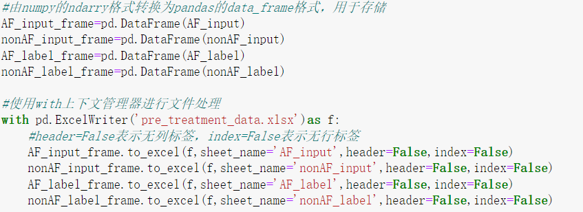

# **二：贝叶斯分类器（十折交叉验证）**

**实验目的：** 
在提取了八个特征值的基础上，对每个单独的属性进行贝叶斯分类器训练，算出最“有价值的”几个属性，便于之后的属性提取已经属性降维。并用贝叶斯分类器算得最佳属性组合的正确率只有83。

**（发现在贝叶斯分类器中用留出法计算不同划分比利时，对模型的影响不大，因为贝叶斯本身特殊的概率算法。）（数据归一化的影响也不大。）**

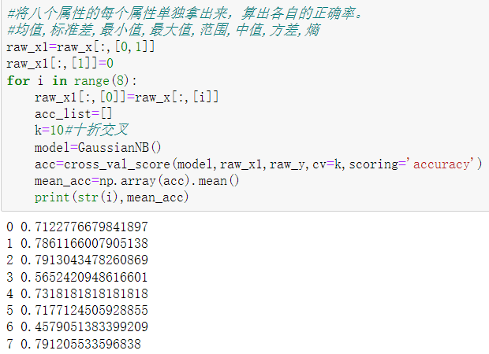

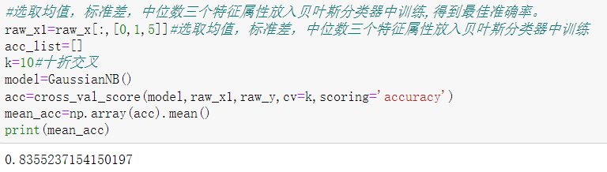

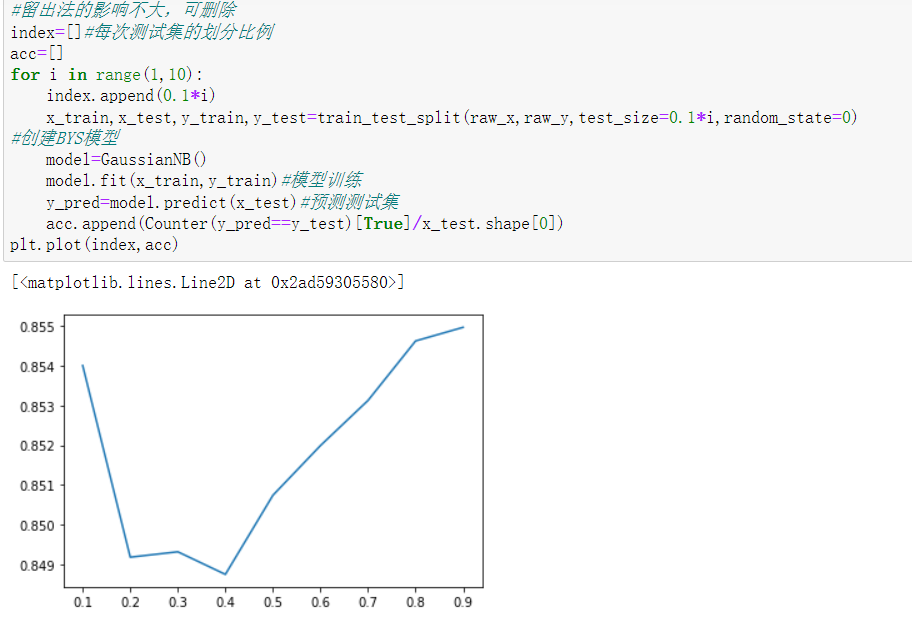

**留出法的影响不大**

**BYS正确率最高只有83.55%**

# **三：KNN模型算法（十折交叉验证）**

**实验目的：**
在八个特征值和贝叶斯分类器每个单独属性得出的结果上，分别选取了6,5,5,4个相关正确率高的属性，并进行了归一化。在不同PCA降维,kNN范围的选取上,参数weights和p上不停调参，以求最高正确率。

（**并发现将数据归一化后，正确率显著上升。PCA同样是降维的维数越低，正确率越差。奇怪的是n维的数据PCA降维到n维时，竟然比源数据直接放进去训练的效果更好。**）

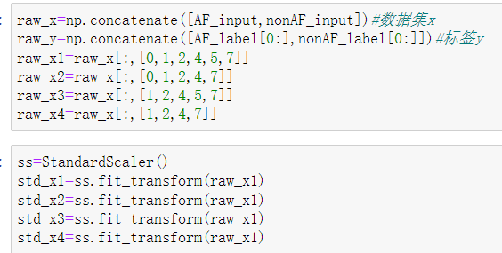

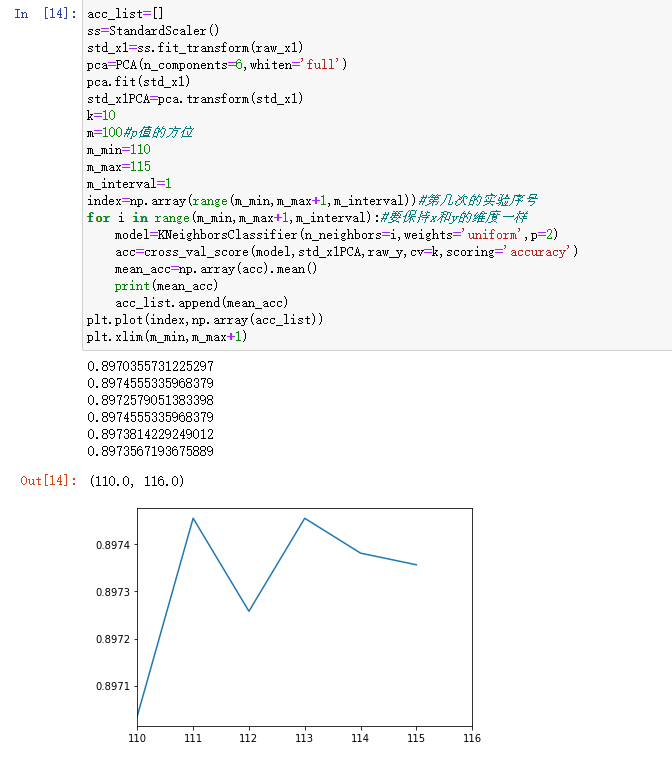

**KNN调参最高正确率：89.75%**

# **四：神经网络MLPClassifier（十折交叉验证）**

**实验目的：**
在八个特征值和贝叶斯分类器每个单独属性得出的结果上，对特征属性考虑是否删除某些特征，是否归一化，是否PCA降维，从而达到最佳的分层状态机训练效果。

（**发现：将数据归一化后，正确率显著上升。PCA同样是降维的维数越低，正确率越差。将KFold的参数shuffle设置为True时，正确率会显著提升。感觉是因为shuffle=True时的十折交叉验证为进行打乱洗牌再验证，会将正确率提高，和cross_val_score默认的十折交叉验证时不太一样。**）

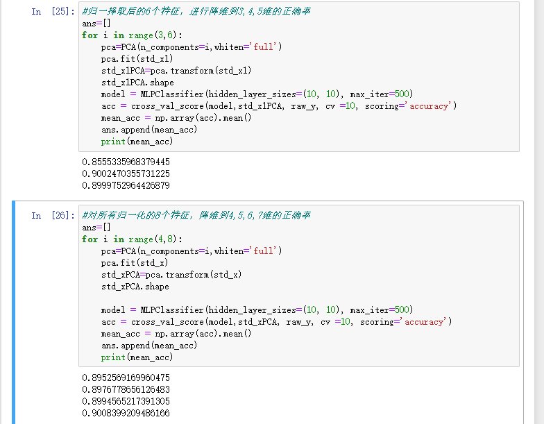

**将特征属性，进行PCA降维，并没有显著提升，且降低的维数越低，正确率往往越低。**

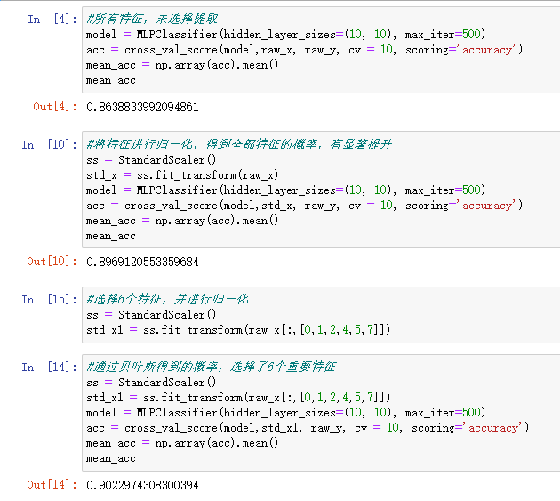

**发现在MLPClassifier中，数据归一化后正确率有显著提升。在贝叶斯分类器得到的结果基础上，选择6个重要特征属性，十折交叉验证的最高正确率有90.23%。**

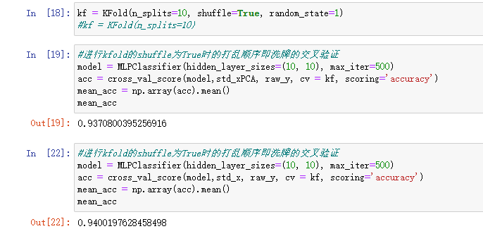

**在MLPClassifier的基础上加上十折交叉验证的KFold，正确率最高达94%。**